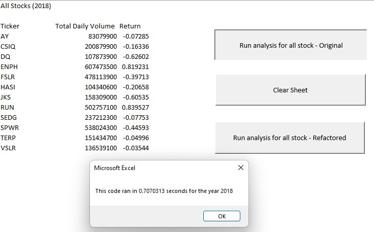
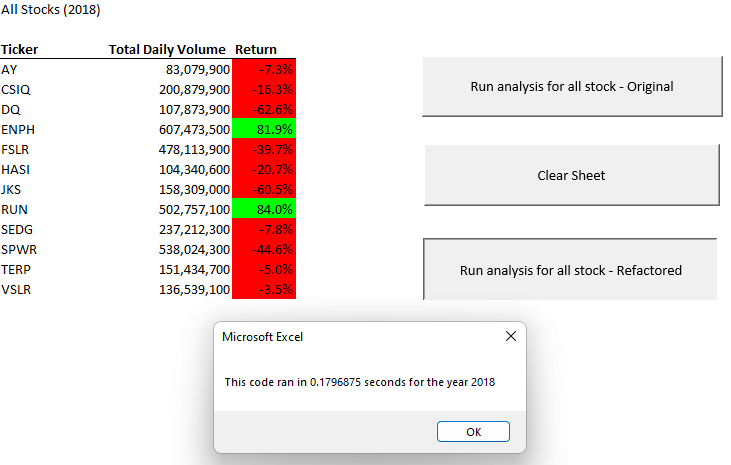

# Analyzing_Stock_with_VBA

## Introduction
This project is designed for financial analysts and data enthusiasts who are interested in optimizing and automating stock market data analysis using Visual Basic for Applications (VBA). The Analyzing_Stock_with_VBA project demonstrates the power of VBA in automating data analysis tasks and the importance of code refactoring for improved efficiency and performance. The main objective is to optimize the script for handling larger datasets and reducing execution time.

## Project Overview
This project will analyze a handful of green energy stocks. By using VBA, we will be create a macro that can trigger pop-ups and inputs and read and change cell values. The macro analyzes stock market data from 2017 and 2018 and outputs key metrics total daily volume and return. In the future, we may want to perform analysis on larger datasets, standarize the format, and know how fast the VBA code will compile the results. To analyze the speed of our code a script that will calculate how long the code takes to execute and output the elapsed time in a message box was added. The [refactored code](Resources/Stock_Analysis_VBS_Code.vba) successfully reduced the macro's execution time.

## Illustrations
  

## Project Status
The project is currently complete, with optimized VBA script and documentation available. 

## Scope of Functionality
The project provides an efficient VBA script for analyzing stock market data and presenting the results in a user-friendly format within Microsoft Excel.

## Installation
Download the Stock_Analysis.xlsm workbook  
Open the workbook in Microsoft Excel  
Enable macros if prompted  

## Usage
To use the tool, open the Excel workbook and click the either of the two "Run analysis for all stock" buttons  
The tool will prompt for a year. Enter either 2017 or 2018 to analyze the stock market data for that year  
Alternatively Press ALT + F11 to open the Microsoft Visual Basic Editor  
Run the script by pressing F5 or clicking the "Run" button  
Observe the stock analysis results and the execution time pop-up messages  

## Features
Create a VBA macro that can trigger pop-ups and inputs, read and change cell values, and format cells  
Use for loops and conditionals to direct logic flow  
Use nested for loops  
The macro offers the following features:  
Ability to analyze stock market data from 2017 or 2018  
Outputs key metrics of total daily volume and return for each stock  
Efficient stock data analysis  
Refactored VBA script for improved performance  

## Roadmap
The project is currently complete. Future plans may include adding new features, such as advanced data visualization techniques, adding additional key metrics, or integrating an external APIs for real-time data retrieval.

## Technologies Used
Microsoft Excel  
Visual Basic for Applications (VBA)  

## Resources
[VBA Documentation](https://learn.microsoft.com/en-us/office/vba/api/overview/)

